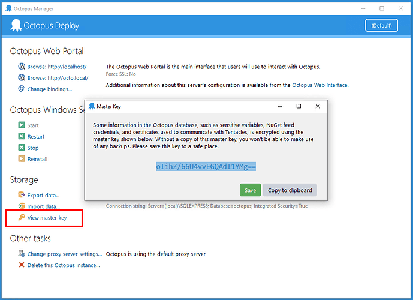

**TODO - Update image reference when received from Design**


## Introduction

New Octopus licenses include support for High Availability meaning teams can run multiple Octopus servers, distributing load and tasks between them. In this post, I’m going to share how to move an on-prem Octopus Server instance to a highly available instance running in Azure.

!toc

## The Problem

Working as part of the Customer Success teams means we work with a range of customers from the smallest organizations using Octopus in a single [Space](https://octopus.com/docs/administration/spaces) to working with Global companies with diverse, distributed technical teams who want to work with Octopus to deploy Infrastructure, Databases and their packaged applications.

In today's cloud-native world, we see a lot of customers who want to move their Octopus workload from On-Premise data centers to Azure.

[High Availability](https://octopus.com/docs/administration/high-availability) enables you to run multiple Octopus Deploy Servers, distributing load and tasks between them. This option has several benefits.

### On-Premise Infrastructure

Most organizations using Octopus, are still running it in a single node configuration on a Virtual Machine hosted on a hypervisor with local storage. It's typically hosted on a dedicated Virtual Machine listening over HTTP or HTTPS using a [LetsEncrypt](https://letsencrypt.org/) SSL certificate or an SSL certificate generated by a [Certificate Authority](https://en.wikipedia.org/wiki/Certificate_authority) much like [GoDaddy](godaddy.com).

Unfortunately, [LetsEncrypt](https://letsencrypt.org/) SSL certificates are not supported automatically in a Highly-Available configuration, so if you are planning moving it to Azure, then you may need one from a [Certificate Authority](https://en.wikipedia.org/wiki/Certificate_authority).

If you're hosting on-Premise, you will likely have Octopus Configured on the C or D Drive, under `C:\Octopus` or `D:\Octopus` with Logs, Artifacts, Packages and Task Logs hosted under folders locally or on a Network Attached Storage device.

Your on-premise setup probably looks something like:

**TODO - Add in Infrastructure diagram of different parts of Octopus.**

## Prep work

There is going to be some preparation required ahead of your move. It will require some time where Octopus is not going to be able to run deployments as you should:

* Enable [Maintenance Mode](https://octopus.com/docs/administration/managing-infrastructure/maintenance-mode).
* [Drain all nodes.](https://octopus.com/docs/administration/high-availability/managing-high-availability-nodes#ManagingHighAvailabilityNodes-Drain)
* [Create a SQL Database backup.](https://octopus.com/docs/support/get-a-database-backup-and-encrypt-the-master-key#step-by-step-guide)
* [Run a backup of your Artifacts, Packages, and Tasklogs and then copy these up to Azure. We would recommend zipping these up into a single compressed file.](https://octopus.com/docs/administration/managing-infrastructure/server-configuration-and-file-storage#ServerconfigurationandFilestorage-FileStorageFilestorage)

### Enabling Maintenance Mode

The first thing to do would be to enable Maintenance Mode. In summary, Maintenance Mode enables you to safely prepare your server for maintenance, allowing existing tasks to complete, and preventing changes you didn't expect.

To enable Maintenance Mode, go to **Configuration > Maintenance**.

**TODO Create Image**


Only users with the `Administer System` permission can enable/disable Maintenance Mode.

Once Octopus is in Maintenance Mode:

* Users with the `Administer System` permission can still do anything they want, just like normal. All other users are prevented from making changes, which includes queuing new deployments or other tasks.
* The task queue will still be processed:
  * Tasks that were already running will run through to completion.
  * Tasks which were already queued (including [scheduled deployments](/docs/deployment-process/releases/index.md#scheduling-a-deployment)) will be started and run through to completion.
  * System tasks will still be queued and execute at their scheduled intervals. These kinds of tasks can be ignored since they are designed to be safe to cancel at any point in time.

### Enabling Node Drain

You also can stop all tasks from being executed on Octopus, and this becomes more useful if you're running Octopus in a Highly-Available configuration. Draining the nodes is helpful if you want to stop Octopus Administrators from running any tasks.

For each node, you need to do the following:

1. Go to **Configuration > Nodes** and put the node into drain mode.
1. Wait for any remaining Octopus Tasks on that node to complete.
1. Stop the Octopus Server windows service on that node.

At this point, your Octopus server is ready to be moved to Azure, and it will restore it in Azure with the nodes drained, and if you enabled Maintenance Mode, then it will also have Maintenance mode enabled.


### Backup your Master Key

If you take one thing from this blog, please let it be this. **Backup, your Master Key**, then **back it up again**, and then lastly, **back it up once more**.

Octopus [encrypts important and sensitive data](/docs/administration/security/data-encryption.md) using a master key. If you lose your master key, then you would lose:

* The Octopus Server X.509 certificate which is used for [Octopus to Tentacle communication](/docs/administration/security/octopus-tentacle-communication/index.md) - this means your Tentacles won't trust your Octopus Server any more.
* Sensitive variable values, wherever you have defined them.
* Sensitive values in your deployment processes, like the password for a custom IIS App Pool user account.
* Sensitive values in your deployment targets, like the password for creating [Offline Drops](/docs/infrastructure/deployment-targets/offline-package-drop.md).

To see your Master Key, log on your Octopus Server, open up Octopus Server Manager and select View master key, and save this to your server as a text file and then back it up to a Password Manager much like [LastPass](http://lastpass.com/) or [KeyPass](https://keepass.info/).



### Proof of Concept vs. Production move

Generally, when doing something for the first time, we recommend running a Proof of Concept before trying it on your production instance of Octopus. You will need to decide whether you are doing this as a Proof of Concept or in Production ahead of time.

One approach would be to move your existing Octopus instance and get this working on Azure. After you get this working, you could add in high-availability by adding in a second node and a load balancer. You would need to have configured shared storage for Artifacts, Packages, and TaskLogs. The benefit of this approach is that it would likely involve less testing, and you can set it to be highly available once your Octopus instance in Azure has been tested and verified.

## Azure Architecture

**TODO - Add Azure Infra Diagram**

## Azure Resources

For automating the spinning up of Azure Resources, a useful resource I use the [Azure Quickstart Tempmate](https://github.com/Azure/azure-quickstart-templates), and the one I use more often than not is the Simple VM for [Windows template](https://github.com/Azure/azure-quickstart-templates/tree/master/101-vm-simple-windows/)

### Octopus Virtual Machines

When creating a Highly-Available configuration, you are going to need to spin up a minimum of two Virtual Machines in Azure to host Octopus. We don't have a one-size-fits-all spec for Octopus as it will depend on:

* [Number and type of Deployment Targets](https://octopus.com/docs/administration/retention-policies)
* [Retention Policies](https://octopus.com/docs/administration/retention-policies)
* [Number of concurrent tasks](https://octopus.com/docs/support/increase-the-octopus-server-task-cap)

If you have a reasonably small workload in Octopus, then you can probably go for a smaller Virtual Machine. Still, the Azure D Series Virtual Machines are a great place to start as they are for general purpose and fit most scenarios reasonably well. Our recommendation would be to consider your workload and then use one of the D Series VM's and see how well this performs for your requirements.

### SQL Database

Octopus is underpinned by a SQL Database that stores environments, projects, variables, releases, and deployment history. You will need to spin up a SQL server in Azure, and there are two options which you should consider, and these are:

* [SQL Server on a Virtual Machine](https://docs.microsoft.com/en-us/azure/virtual-machines/windows/sql/virtual-machines-windows-sql-server-iaas-overview)
* [Azure SQL Database as a Service](https://docs.microsoft.com/en-us/azure/sql-database/sql-database-technical-overview)

Octopus natively works with both of these options, and we don't have a preference and will be a decision you will need to make. If you have access to a Database Administrator, then I would seek out their expertise on the matter.

#### SQL Virtual Machine

**TODO - Add benefits and how to spin up SQL Virtual Machine**

#### Azure SQL

**TODO - Add benefits and how to spin up Azure SQL**

### Storage

**TODO - Add in details about the different types of storage.**

#### Local Storage

You are going to need some local storage for Octopus to be installed on

#### Artifacts, Packages & Task Logs

Octopus stores several files that are not suitable to store in the database. These include:

* NuGet packages used by the [built-in NuGet repository](https://octopus.com/docs/packaging-applications/package-repositories) inside Octopus. These packages can often be substantial.
* Artifacts collected during a deployment. Teams using Octopus sometimes use this feature to collect large log files and other files from machines during a deployment.
* Task logs, which are text files that store all of the log output from deployments and other tasks.

As with the database, from the Octopus perspective, you'll tell the Octopus Servers where to store them as a file path within your operating system. Octopus doesn't care what technology you use to present the shared storage; it could be a mapped network drive or a UNC path to a file share. Each of these three types of data can be stored in a different place.

Whichever way you provide the shared storage, a few considerations to keep in mind:

* To Octopus, it needs to appear as a mapped network drive (e.g., D:\) or a UNC path to a file share (e.g., \\server\path)
* The service account that Octopus runs as needs full control over the directory
* Drives are mapped per-user, so you should assign the drive using the same service account that Octopus is running under

#### Azure Files

If your Octopus Server is running in Microsoft Azure, there is only one solution unless you have a [DFS Replica](https://docs.microsoft.com/en-us/windows-server/storage/dfs-replication/dfsr-overview) in Azure. That solution is [Azure File Storage](https://docs.microsoft.com/en-us/azure/storage/files/storage-files-introduction) - it just presents a file share over SMB 3.0 that will be shared across all of your Octopus servers.

Once you have created your File Share, I find the best option is to add the Azure File Share as a [symbolic link](https://en.wikipedia.org/wiki/Symbolic_link) and then adding this in to `C:\Octopus\` for the Artifacts, Packages and TaskLogs which need to be shared between your Octopus nodes.

Run the below before installing Octopus.

````powershell
# Add the Authentication for the symbolic links. You can get this from the Azure Portal.

cmdkey /add:octostorage.file.core.windows.net /user:Azure\octostorage /pass:XXXXXXXXXXXXXX

# Add Octopus folder to add symbolic links

New-Item -ItemType directory -Path C:\Octopus
New-Item -ItemType directory -Path C:\Octopus\Artifacts
New-Item -ItemType directory -Path C:\Octopus\Packages
New-Item -ItemType directory -Path C:\Octopus\TaskLogs

# Add the Symbolic Links. Do this before installing Octopus.

mklink /D C:\Octopus\TaskLogs \\octostorage.file.core.windows.net\octoha\TaskLogs
mklink /D C:\Octopus\Artifacts \\octostorage.file.core.windows.net\octoha\Artifacts
mklink /D C:\Octopus\Packages \\octostorage.file.core.windows.net\octoha\Packages
````

[Install Octopus](https://octopus.com/docs/installation) and then run the below.

````powershell

# Set the path
& 'C:\Program Files\Octopus Deploy\Octopus\Octopus.Server.exe' path --artifacts "C:\Octopus\Artifacts"
& 'C:\Program Files\Octopus Deploy\Octopus\Octopus.Server.exe' path --taskLogs "C:\Octopus\TaskLogs"
& 'C:\Program Files\Octopus Deploy\Octopus\Octopus.Server.exe' path --nugetRepository "C:\Octopus\Packages"
````

### Load Balancer

This one took me a bit of time to make a selection as there are a few options for balancing your loads in Azure. It will depend entirely on your preference and what your Network team has a choice for as there are so many options, and we are only listing a few of these below.

* [Azure Traffic Manager](https://docs.microsoft.com/en-us/azure/traffic-manager/traffic-manager-overview)
* [Azure Application Gateway](https://docs.microsoft.com/en-us/azure/application-gateway/overview)
* [Azure Load Balancer](https://docs.microsoft.com/en-us/azure/load-balancer/load-balancer-overview)
* [Kemp LoadMaster](https://kemptechnologies.com/uk/solutions/microsoft-load-balancing/loadmaster-azure/)
* [F5 Big-IP Virtual Edition](https://www.f5.com/partners/technology-alliances/microsoft-azure)

My preference after evaluating the options on Azure is the Azure Load Balancer option as this is a feature-rich

### Networking

Networking at the best of times is a contentious issue, and your configuration will depend heavily on your existing network topology and standards.

I'd consider implementing one or some of the below to help your protect your Azure workload:

* [Azure Bastion](https://azure.microsoft.com/en-gb/services/azure-bastion/)
* [VPN Gateway](https://azure.microsoft.com/en-gb/services/vpn-gateway/)
* [ExpressRoute](https://azure.microsoft.com/en-gb/services/expressroute/)
* [A Jump Box](https://en.wikipedia.org/wiki/Jump_server)

I'd look to use existing methods to connect to Azure if you already have this in place. If you have ExpressRoute, then this is the best approach, but much like with anything, it's the most expensive. If you have a VPN Gateway, or a jump box or even Azure Bastion service, then I would recommend using these to your advantage.

## Octopus post-move tasks & verification

Once you have configured Octopus, we would recommend running some verification of the configuration.

### Azure Checklist

A resource I find useful when provisioning Azure Infrastructure is the [Azure Checklist](http://azurechecklist.com/) as this contains almost everything you need to test and verify Azure Infrastructure.

### Disabling Maintenance Mode

To disable Maintenance Mode, go to **Configuration > Maintenance**. When maintenance mode is disabled, it will mean that Users can start deployments again, and we would recommend running some test deployments.

### Disabling Node Drain

Once you have disabled Maintenance Mode, then you will need to tell Octopus to run tasks again, and you do this for each node by doing the following:

1. Go to **Configuration > Nodes** and disable node drain.

### Tentacles

You are most likely using Tentacle for most of your deployments, and there are some things to consider as part of this.

#### Listening Tentacles

Listening Tentacles, for the most part, won't need any changes as the Octopus Server connects directly to them. If you are connecting to the servers on-Premise, then you may need to set up [NAT rules](https://en.wikipedia.org/wiki/Network_address_translation) to allow Octopus to communicate as it may have been using private IP's or DNS to connect.

#### Polling Tentacles

There will need to be some consideration for Polling Tentacles, and mostly this is to do with the tentacles connecting directly into the Octopus server using their DNS name. So if you were previously connecting to `octopus.domain.local` and now you have Octopus on `octopus.loadbalancedurl.com`, then you are going to need to update your polling tentacle to point to `octopus.loadbalancedurl.com`.

You can achieve this by removing the previous configuration from Octopus and then automating the installation of the [Polling tentacle](https://octopus.com/docs/infrastructure/deployment-targets/windows-targets/automating-tentacle-installation#AutomatingTentacleinstallation-Example:PollingTentacle).

## Summary

**TODO - Add Summary**
